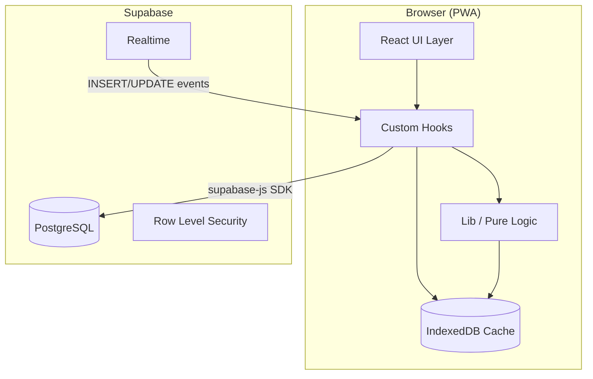
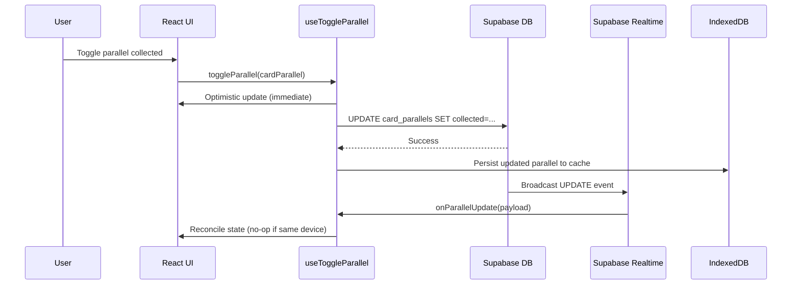
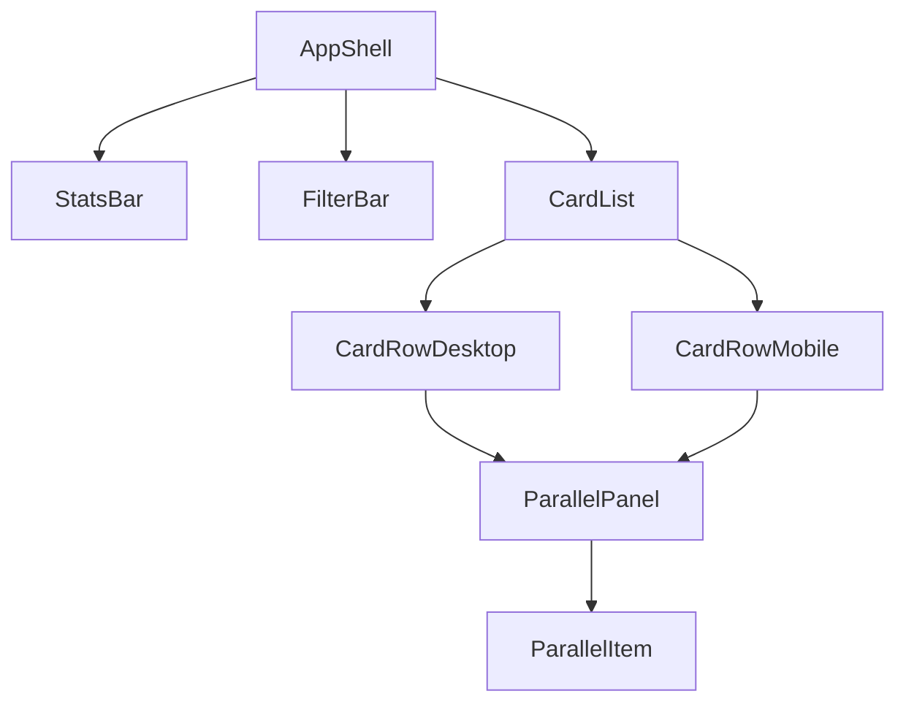

# Design Document: Parallel Tracking

## Overview

This feature extends the Topps Premier League Tracker PWA to support parallel variant tracking. Currently, each card has a single `collected` boolean. With parallel tracking, each card can have multiple parallel variants (e.g., "Base", "Blue Voltage", "Gold /50", "FoilFractor 1/1"), each independently trackable as collected or uncollected.

The implementation introduces a new `card_parallels` Supabase table, extends the TypeScript type system with a `CardParallel` interface, updates the CSV importer to handle a `parallel` column, adds an expandable `ParallelPanel` UI component within each card row, creates a dedicated toggle hook for parallel items, extends the stats engine to compute parallel progress, updates the IndexedDB offline cache schema, adds Realtime subscriptions for the parallels table, and integrates parallel completion status into existing filters.

### Key Design Decisions

1. **Separate table over JSON column**: Parallels are stored in a dedicated `card_parallels` table rather than a JSON array on the `cards` table. This enables Supabase Realtime subscriptions, Row Level Security per row, efficient upserts, and independent querying.
2. **Card-level status derived from "Base" parallel**: The existing card-level `collected` boolean is deprecated in favor of deriving it from the "Base" parallel's collected status. This maintains backward compatibility with the existing UI while the new model is the source of truth.
3. **IndexedDB version bump**: The offline cache upgrades from DB version 1 to version 2, adding a `card-parallels` object store while preserving existing card data.
4. **Optimistic UI pattern reused**: The existing `useToggleCollected` pattern (optimistic update → persist → revert on failure) is replicated for parallel toggles via a new `useToggleParallel` hook.

---

## Architecture



### Data Flow



### Component Hierarchy (Changed Components)



---

## Components and Interfaces

### New Components

#### `ParallelPanel` (`src/components/ParallelPanel.tsx`)

An expandable/collapsible panel that displays all parallel variants for a card.

```typescript
export interface ParallelPanelProps {
  parallels: CardParallel[];
  onToggleParallel: (parallel: CardParallel) => void;
  togglingIds: Set<string>;
  isExpanded: boolean;
}

export function ParallelPanel(props: ParallelPanelProps): JSX.Element;
```

**Behavior:**
- Sorts parallels: collected first, then uncollected, alphabetical within each group
- Each parallel item has a 44x44px tap target toggle control
- Displays parallel_name and collected/uncollected indicator
- Supports keyboard navigation (Tab through items, Enter/Space to toggle)

#### `ParallelItem` (`src/components/ParallelItem.tsx`)

Individual parallel variant row within the ParallelPanel.

```typescript
export interface ParallelItemProps {
  parallel: CardParallel;
  onToggle: (parallel: CardParallel) => void;
  isToggling: boolean;
}

export function ParallelItem(props: ParallelItemProps): JSX.Element;
```

### Modified Components

#### `CardRowDesktop` / `CardRowMobile` (updated)

- Adds expand/collapse button (chevron icon) meeting 44x44px tap target
- Displays parallel count indicator (e.g., "3/38")
- Manages `isExpanded` state (local per row)
- Card-level toggle now toggles the "Base" parallel

#### `FilterBar` (updated)

- Adds a fourth dropdown: "Parallel Status" with options: "All", "Has uncollected parallels", "All parallels collected"

#### `StatsBar` (updated)

- Displays a secondary metric: "X / Y parallels collected" with its own progress bar
- Per-set breakdown includes parallel counts when expanded

### New Hooks

#### `useToggleParallel` (`src/hooks/useToggleParallel.ts`)

```typescript
export function useToggleParallel(
  supabase: SupabaseClient,
  updateParallels: (updater: (parallels: CardParallel[]) => CardParallel[]) => void
): {
  toggleParallel: (parallel: CardParallel) => Promise<void>;
  togglingIds: Set<string>;
};
```

Mirrors the existing `useToggleCollected` pattern with optimistic updates, in-flight tracking, and queued state for rapid taps.

#### `useRealtimeSubscription` (updated)

Extended to subscribe to `card_parallels` table INSERT and UPDATE events in addition to `cards` table events.

```typescript
export interface UseRealtimeSubscriptionOptions {
  supabase: SupabaseClient;
  onCardUpdate: (card: Card) => void;
  onParallelUpdate: (parallel: CardParallel) => void;  // NEW
  onStatusChange?: (status: ConnectionStatus) => void;
  onReconnected?: () => void;
}
```

### New Lib Modules

#### `src/lib/parallel-toggle.ts`

```typescript
export function createParallelToggleState(
  parallel: CardParallel
): { collected: boolean; date_collected: string | null };

export async function persistParallelToggle(
  supabase: SupabaseClient,
  parallelId: string,
  collected: boolean,
  dateCollected: string | null
): Promise<void>;

export function revertParallelToggle(
  parallel: CardParallel,
  previousState: { collected: boolean; date_collected: string | null }
): CardParallel;
```

#### `src/lib/parallel-sort.ts`

```typescript
/** Sorts parallels: collected first, then uncollected, alphabetical within each group */
export function sortParallels(parallels: CardParallel[]): CardParallel[];
```

#### `src/lib/parallel-filters.ts`

```typescript
export type ParallelFilterStatus = 'all' | 'has_uncollected' | 'all_collected';

/** Filters cards by their parallel completion status */
export function filterByParallelStatus(
  cards: Card[],
  parallelsMap: Map<string, CardParallel[]>,
  status: ParallelFilterStatus
): Card[];
```

### Modified Lib Modules

#### `src/lib/csv-import.ts` (updated)

- `ParsedRow` extended with `parallel_name: string` field
- Header validation accepts "parallel" column (optional)
- Accepts "set" as alias for "set_name" 
- Defaults missing/empty parallel to "Base"
- Validates parallel_name is non-empty after trim

#### `src/lib/stats.ts` (updated)

```typescript
export interface ParallelStats {
  totalCollected: number;
  totalAvailable: number;
  percentage: string;
}

export interface SetParallelBreakdown {
  setName: string;
  parallelsCollected: number;
  parallelsTotal: number;
}

export function computeParallelStats(parallels: CardParallel[]): ParallelStats;
export function computePerSetParallelBreakdown(
  cards: Card[],
  parallels: CardParallel[]
): SetParallelBreakdown[];
```

#### `src/lib/offline-cache.ts` (updated)

- DB_VERSION bumped from 1 to 2
- New object store: `card-parallels` 
- New functions: `saveParallelsToCache`, `loadParallelsFromCache`
- Pending offline toggles stored in a `pending-parallel-toggles` store for sync on reconnection

---

## Data Models

### Database Schema

#### `card_parallels` table (new)

| Column         | Type        | Constraints                              |
|----------------|-------------|------------------------------------------|
| id             | uuid        | PRIMARY KEY, default gen_random_uuid()   |
| card_id        | uuid        | NOT NULL, REFERENCES cards(id) ON DELETE CASCADE |
| parallel_name  | text        | NOT NULL                                 |
| collected      | boolean     | NOT NULL, DEFAULT false                  |
| date_collected | date        | NULLABLE                                 |
| created_at     | timestamptz | NOT NULL, DEFAULT now()                  |

**Constraints:**
- `UNIQUE (card_id, parallel_name)` — enforces one record per card+parallel combination
- Foreign key to `cards(id)` with CASCADE delete

**Indexes:**
- Primary key index on `id`
- Unique index on `(card_id, parallel_name)`
- Index on `card_id` for efficient joins

**Row Level Security:**
- Policies mirror the existing `cards` table RLS (same user_id-based access)

#### SQL Migration

```sql
CREATE TABLE card_parallels (
  id uuid PRIMARY KEY DEFAULT gen_random_uuid(),
  card_id uuid NOT NULL REFERENCES cards(id) ON DELETE CASCADE,
  parallel_name text NOT NULL,
  collected boolean NOT NULL DEFAULT false,
  date_collected date,
  created_at timestamptz NOT NULL DEFAULT now(),
  UNIQUE (card_id, parallel_name)
);

CREATE INDEX idx_card_parallels_card_id ON card_parallels(card_id);

-- Enable RLS
ALTER TABLE card_parallels ENABLE ROW LEVEL SECURITY;

-- RLS policy (matches cards table pattern)
CREATE POLICY "Users can manage their own parallels"
  ON card_parallels
  FOR ALL
  USING (
    card_id IN (SELECT id FROM cards WHERE user_id = auth.uid())
  );

-- Enable Realtime
ALTER PUBLICATION supabase_realtime ADD TABLE card_parallels;
```

### TypeScript Types

#### New Types (`src/types/index.ts`)

```typescript
export interface CardParallel {
  id: string;              // UUID
  card_id: string;         // FK to Card.id
  parallel_name: string;   // e.g., "Base", "Blue Voltage", "Gold /50"
  collected: boolean;
  date_collected: string | null;  // ISO date string
  created_at: string;      // ISO timestamp
}

export type ParallelFilterStatus = 'all' | 'has_uncollected' | 'all_collected';

export interface FilterState {
  searchText: string;
  setName: string | null;
  collectedStatus: 'all' | 'collected' | 'missing';
  parallelStatus: ParallelFilterStatus;  // NEW
}

export interface ImportSummary {
  inserted: number;
  parallelsCreated: number;  // NEW
  skipped: number;
  rejected: number;
  errors: ImportError[];
}
```

#### Updated `ParsedRow` (in `csv-import.ts`)

```typescript
export interface ParsedRow {
  card_number: string;
  set_name: string;
  set_card_number: string;
  player: string;
  team: string;
  notes: string | null;
  parallel_name: string;  // NEW — defaults to "Base"
}
```

### IndexedDB Schema (Version 2)

```
Database: pl-tracker-cache (version 2)
├── Object Store: cards (existing, key: 'all-cards')
├── Object Store: card-parallels (NEW, key: 'all-parallels')
└── Object Store: pending-parallel-toggles (NEW, auto-increment key)
    └── Record: { parallelId, collected, date_collected, timestamp }
```

The `onupgradeneeded` handler checks the old version and creates new stores without touching existing ones:

```typescript
request.onupgradeneeded = (event) => {
  const db = request.result;
  const oldVersion = event.oldVersion;

  if (oldVersion < 1) {
    db.createObjectStore('cards');
  }
  if (oldVersion < 2) {
    db.createObjectStore('card-parallels');
    db.createObjectStore('pending-parallel-toggles', { autoIncrement: true });
  }
};
```

---

## Correctness Properties

*A property is a characteristic or behavior that should hold true across all valid executions of a system — essentially, a formal statement about what the system should do. Properties serve as the bridge between human-readable specifications and machine-verifiable correctness guarantees.*

### Property 1: Parallel sort ordering

*For any* list of CardParallel records, sorting SHALL produce an output where all collected items appear before all uncollected items, and within each group (collected / uncollected), items are ordered alphabetically by parallel_name (case-insensitive).

**Validates: Requirements 2.7**

### Property 2: Parallel toggle state transition

*For any* CardParallel, toggling its collected status SHALL flip `collected` to its boolean inverse, set `date_collected` to today's ISO date string when becoming collected, and set `date_collected` to null when becoming uncollected.

**Validates: Requirements 3.2, 3.3**

### Property 3: Card-level status derivation from Base parallel

*For any* Card with associated parallels, the card-level collected status SHALL be `true` if and only if a parallel named "Base" exists for that card AND that parallel has `collected === true`. In all other cases (no Base parallel, or Base parallel with `collected === false`), the card-level status SHALL be `false`.

**Validates: Requirements 4.1, 4.2, 4.4**

### Property 4: Overall parallel statistics aggregation

*For any* array of CardParallel records, the computed parallel stats SHALL report `totalCollected` equal to the count of records where `collected === true`, `totalAvailable` equal to the array length, and `percentage` equal to `(totalCollected / totalAvailable * 100).toFixed(1) + '%'` (or "0.0%" for empty arrays).

**Validates: Requirements 5.1**

### Property 5: Per-set parallel statistics

*For any* collection of Cards and CardParallels, grouping parallels by their card's set_name SHALL produce per-set counts where each set's `parallelsCollected` equals the count of collected parallels within that set, and `parallelsTotal` equals the total parallels within that set.

**Validates: Requirements 5.2, 5.4**

### Property 6: CSV import partition invariant

*For any* valid CSV content with N data rows, the ImportSummary SHALL satisfy: `inserted + skipped + rejected === N` (where `inserted` counts new cards, `skipped` counts duplicate upserts, and `rejected` counts validation failures). No rows are silently lost.

**Validates: Requirements 6.6, 6.7**

### Property 7: CSV card deduplication

*For any* set of valid CSV rows, the number of Card records created or updated SHALL equal the number of distinct `card_number` values across all valid rows.

**Validates: Requirements 6.3**

### Property 8: CSV parallel deduplication

*For any* set of valid CSV rows, the number of CardParallel records created or updated SHALL equal the number of distinct `(card_number, parallel_name)` pairs across all valid rows.

**Validates: Requirements 6.4**

### Property 9: Empty parallel name defaults to "Base"

*For any* CSV row where the parallel field is empty, missing, or contains only whitespace characters, the CSV importer SHALL assign the parallel_name as "Base".

**Validates: Requirements 6.5, 7.1**

### Property 10: CSV import/export round-trip

*For any* valid CSV content, importing the content into the database then exporting the database state back to CSV then re-importing that exported CSV SHALL produce a database state equivalent to the state after the first import (idempotent round-trip).

**Validates: Requirements 6.8**

### Property 11: Parser accepts special characters in parallel names

*For any* string containing alphanumeric characters, spaces, forward slashes, ampersands, apostrophes, hyphens, or periods (matching the pattern used in real parallel names like "FoilFractor 1/1", "Black & White /75"), the CSV parser and validator SHALL accept it as a valid parallel_name without error.

**Validates: Requirements 7.2**

### Property 12: Parser handles quoted fields with internal commas

*For any* parallel_name string containing one or more commas, when that value is properly quoted in a CSV field (surrounded by double quotes), the CSV parser SHALL extract the complete value as a single field without splitting on internal commas.

**Validates: Requirements 7.5**

### Property 13: Parallel filter — "Has uncollected parallels"

*For any* set of Cards with associated CardParallels, when the "has_uncollected" parallel filter is active, every card in the result SHALL have at least one CardParallel with `collected === false`, and every card excluded from the result SHALL have all CardParallels with `collected === true`.

**Validates: Requirements 10.3**

### Property 14: Parallel filter — "All parallels collected"

*For any* set of Cards with associated CardParallels, when the "all_collected" parallel filter is active, every card in the result SHALL have all CardParallels with `collected === true`, and every card excluded from the result SHALL have at least one CardParallel with `collected === false`.

**Validates: Requirements 10.4**

---

## Error Handling

### Network Errors (Parallel Toggle)

| Scenario | Behavior |
|----------|----------|
| Toggle persist fails (network error, 5xx) | Revert optimistic UI update, show brief toast/inline error |
| Toggle persist fails (constraint violation) | Revert UI, log error (should not happen in normal flow) |
| Rapid toggles during connectivity loss | Queue in IndexedDB `pending-parallel-toggles` store, sync when online |

### CSV Import Errors

| Scenario | Behavior |
|----------|----------|
| Invalid parallel_name (empty/whitespace after trim) | Reject row, record error with row number |
| Duplicate (card_number, parallel_name) within same file | Upsert (last occurrence wins), count in "skipped" |
| Missing "parallel" column | Fall back to legacy mode, assign "Base" to all rows |
| Malformed quoted field | Reject row, record parse error |

### Offline/Sync Errors

| Scenario | Behavior |
|----------|----------|
| IndexedDB write failure | Log warning, continue with in-memory state |
| Pending sync fails on reconnection | Retry with exponential backoff (reuse existing `reconnection.ts` logic) |
| Conflict between offline toggle and server state | Server state wins (last-write-wins); UI reconciles on re-fetch |

### Realtime Subscription Errors

| Scenario | Behavior |
|----------|----------|
| Channel error on `card_parallels` subscription | Trigger reconnection via existing `ReconnectionManager` |
| Missed events during disconnection | Full re-fetch of card_parallels on reconnection (Requirement 9.3) |

---

## Testing Strategy

### Property-Based Tests (fast-check 4)

Each correctness property maps to a single property-based test in `src/lib/__tests__/`. Tests run with minimum 100 iterations.

| Test File | Properties Covered | Functions Under Test |
|-----------|-------------------|---------------------|
| `parallel-sort.property.test.ts` | Property 1 | `sortParallels()` |
| `parallel-toggle-state.property.test.ts` | Property 2 | `createParallelToggleState()` |
| `card-level-status.property.test.ts` | Property 3 | `deriveCardCollectedStatus()` |
| `parallel-stats.property.test.ts` | Properties 4, 5 | `computeParallelStats()`, `computePerSetParallelBreakdown()` |
| `csv-import-parallels.property.test.ts` | Properties 6, 7, 8, 9, 10, 11, 12 | `parseCSV()`, `validateRow()`, `processCSVFile()` |
| `parallel-filters.property.test.ts` | Properties 13, 14 | `filterByParallelStatus()` |

**Tag format for each test:** `// Feature: parallel-tracking, Property N: <property text>`

**Generators needed:**
- `arbCardParallel()` — generates valid CardParallel records with realistic parallel_name values
- `arbCardWithParallels()` — generates a Card with 1–40 associated CardParallels
- `arbCSVRowWithParallel()` — generates valid CSV rows including the parallel column
- `arbParallelName()` — generates realistic parallel names (Base, "Color /N", "Special 1/1", etc.)

### Unit Tests (Vitest + Testing Library)

Example-based tests for specific scenarios, edge cases, and UI interactions:

| Test File | Coverage |
|-----------|----------|
| `ParallelPanel.test.tsx` | Expand/collapse, keyboard navigation, tap targets, indicator display |
| `ParallelItem.test.tsx` | Toggle interaction, loading state, accessibility |
| `CardRow.test.tsx` (updated) | Parallel count display, Base toggle delegation |
| `FilterBar.test.tsx` (updated) | New parallel status dropdown |
| `StatsBar.test.tsx` (updated) | Dual metric display |
| `useToggleParallel.test.ts` | Optimistic update, revert on failure, queue behavior |

### Integration Tests

| Test File | Coverage |
|-----------|----------|
| `offline-cache.integration.test.ts` | IndexedDB version upgrade, parallel save/load, pending toggle queue |
| `csv-import.integration.test.ts` | Full file → parse → validate → upsert flow with mock Supabase |

### Test Configuration

```typescript
// Property test example structure
import { fc } from 'fast-check';
import { describe, it, expect } from 'vitest';
import { sortParallels } from '../parallel-sort';
import { arbCardParallel } from './generators';

describe('parallel-sort', () => {
  it('collected items always precede uncollected items', () => {
    // Feature: parallel-tracking, Property 1: Parallel sort ordering
    fc.assert(
      fc.property(fc.array(arbCardParallel()), (parallels) => {
        const sorted = sortParallels(parallels);
        const firstUncollected = sorted.findIndex(p => !p.collected);
        const lastCollected = sorted.findLastIndex(p => p.collected);
        if (firstUncollected !== -1 && lastCollected !== -1) {
          expect(lastCollected).toBeLessThan(firstUncollected);
        }
      }),
      { numRuns: 100 }
    );
  });
});
```
