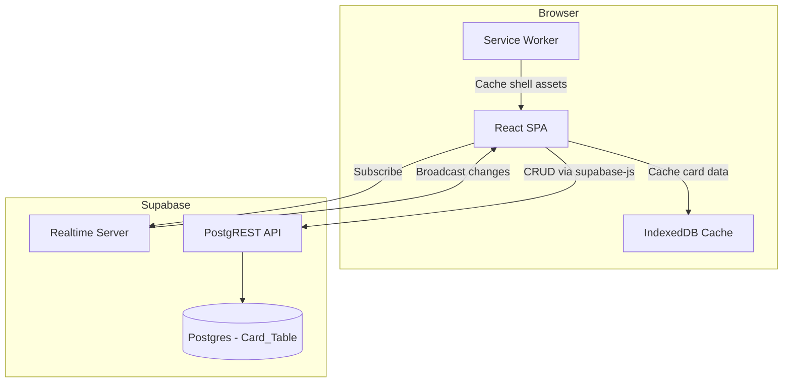
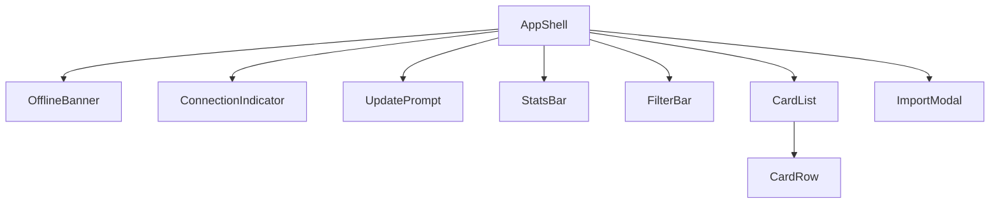
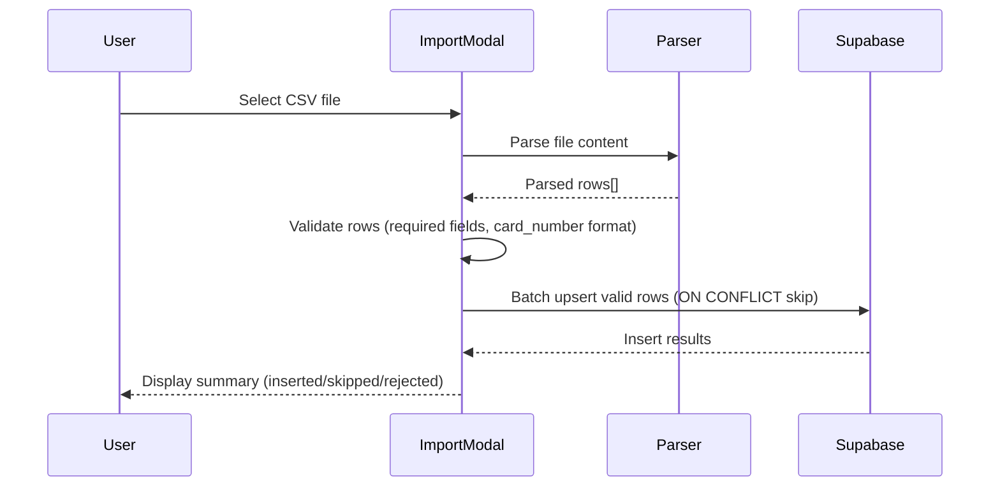
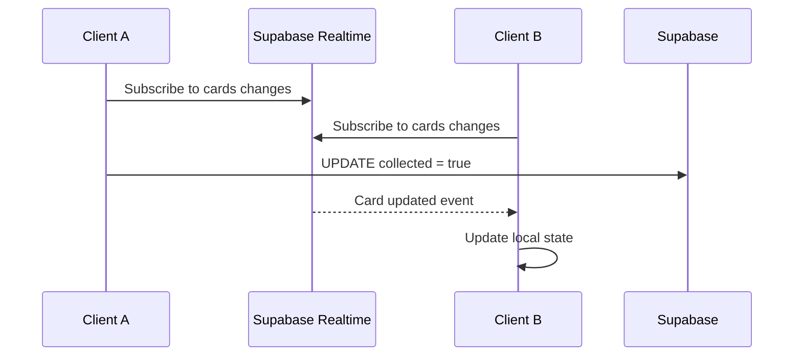
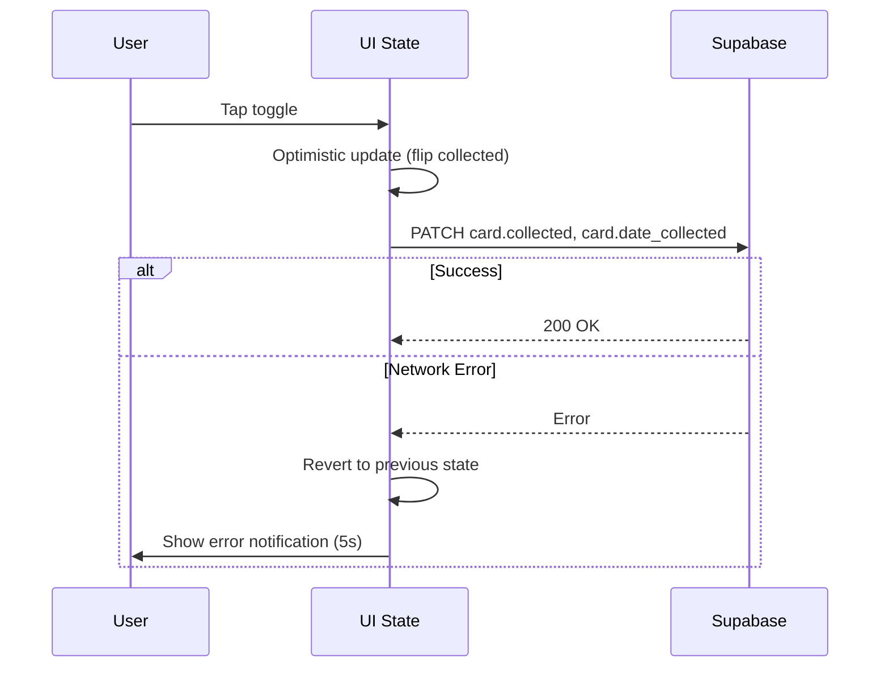

# Design Document

## Overview

The Premier League Tracker is a single-user personal web application for managing a Topps Premier League 2026/27 trading card collection (~1,137 cards). The system consists of a React SPA frontend communicating with a Supabase backend (hosted Postgres + Realtime). The app supports:

- Importing card data from CSV into Supabase
- Browsing, searching, and filtering the checklist
- Toggling cards as collected/uncollected with optimistic UI updates
- Real-time cross-device sync via Supabase Realtime
- Offline-capable PWA with service worker caching
- Responsive layout from mobile (320px) to desktop (2560px)

The design prioritises simplicity — a single database table, client-side filtering/sorting, and Supabase's built-in Realtime for sync — while structuring the schema for future multi-user expansion.

## Architecture



**Key architectural decisions:**

1. **Client-side filtering and sorting**: With ~1,137 cards, the full dataset fits comfortably in memory. The app fetches all cards on load and performs search/filter/sort in the browser. This eliminates round-trips for every filter change and enables instant feedback.

2. **Supabase Realtime for sync**: Rather than polling, the app subscribes to Postgres changes via Supabase Realtime channels. This gives sub-second updates across devices with minimal code.

3. **Optimistic updates**: Collection toggles update the UI immediately and persist asynchronously. Failures trigger a revert with user notification.

4. **PWA with cache-first shell**: The service worker caches static assets (HTML/CSS/JS) for instant load. Card data is cached in IndexedDB for offline viewing.

## Components and Interfaces

### Component Tree



### Component Specifications

#### AppShell
- Root layout component
- Manages Supabase client initialisation and Realtime subscription lifecycle
- Holds global state: cards array, connection status, filters, sort config

#### OfflineBanner
- Props: `isOffline: boolean`
- Renders a persistent top banner when the device has no network connectivity
- Auto-hides within 5 seconds of connectivity restoration

#### ConnectionIndicator
- Props: `status: 'connected' | 'reconnecting' | 'disconnected'`
- Displays realtime connection state
- Shows manual retry button in disconnected state

#### UpdatePrompt
- Props: `newVersionAvailable: boolean`, `onReload: () => void`
- Inline prompt shown when a new service worker version is detected

#### StatsBar
- Props: `cards: Card[]`
- Computes and displays: total collected / total, percentage, per-set breakdown
- Calculates from the full unfiltered card set (independent of active filters)

#### FilterBar
- Props: `setNames: string[]`, `filters: FilterState`, `onFilterChange: (filters: FilterState) => void`
- Free-text search input (max 100 chars, debounced 300ms)
- Set name dropdown (alphabetical, with "All Sets" default)
- Collected status dropdown ("All", "Collected", "Missing")

#### CardList
- Props: `cards: Card[]`, `sortConfig: SortConfig`, `onSortChange: (col: SortColumn) => void`, `onToggleCollected: (cardId: string) => void`, `isLoading: boolean`
- Renders table (≥768px) or stacked cards (<768px)
- Columns: binder card number, set name, set card number, player, team, collected status
- Visual distinction for collected vs uncollected rows
- Loading state and empty state handling

#### CardRow
- Props: `card: Card`, `onToggleCollected: (cardId: string) => void`, `isToggling: boolean`
- Single card display with tap-to-toggle collected status
- Minimum 44x44px tap target on mobile

#### ImportModal
- Props: `onImportComplete: (summary: ImportSummary) => void`
- File picker for CSV upload
- Parses CSV, validates rows, upserts to Supabase
- Displays import summary (inserted, skipped, rejected counts)

### Interfaces

```typescript
interface Card {
  id: string;              // UUID
  user_id: string | null;  // UUID, nullable
  card_number: number;     // Binder card number (positive integer)
  set_name: string;
  set_card_number: string;
  player: string;
  team: string;
  notes: string | null;
  collected: boolean;
  date_collected: string | null; // ISO date string
  created_at: string;      // ISO timestamp
}

interface FilterState {
  searchText: string;      // Max 100 chars
  setName: string | null;  // null = "All Sets"
  collectedStatus: 'all' | 'collected' | 'missing';
}

interface SortConfig {
  column: SortColumn;
  direction: 'asc' | 'desc';
}

type SortColumn = 'card_number' | 'set_name' | 'set_card_number' | 'player' | 'team' | 'collected';

interface ImportSummary {
  inserted: number;
  skipped: number;
  rejected: number;
  errors: ImportError[];
}

interface ImportError {
  row: number;
  reason: string;
}

interface RealtimeConfig {
  maxRetries: 5;
  initialBackoff: 1000;    // ms
  backoffMultiplier: 2;
}
```

### State Management

The app uses React state (useState/useReducer) at the AppShell level — no external state library needed for this scale:

- `cards: Card[]` — full card dataset, updated via Realtime
- `filters: FilterState` — current filter/search state
- `sortConfig: SortConfig` — current sort column and direction
- `connectionStatus: 'connected' | 'reconnecting' | 'disconnected'`
- `isOffline: boolean` — navigator.onLine status
- `isLoading: boolean` — initial data fetch in progress

Derived state (filtered/sorted cards, stats) is computed via `useMemo` from the cards array and filter/sort config.

### Key Hooks

```typescript
// Supabase realtime subscription with reconnection logic
useRealtimeSubscription(supabase, onCardUpdate, onStatusChange)

// Debounced search input
useDebouncedValue(value, delay: 300)

// Online/offline detection
useOnlineStatus()

// Service worker registration and update detection
useServiceWorker(onUpdateAvailable)
```

## Data Models

### Database Schema (Supabase Postgres)

```sql
CREATE TABLE cards (
  id UUID PRIMARY KEY DEFAULT gen_random_uuid(),
  user_id UUID DEFAULT NULL,
  card_number INTEGER NOT NULL,
  set_name TEXT NOT NULL,
  set_card_number TEXT NOT NULL,
  player TEXT NOT NULL,
  team TEXT NOT NULL,
  notes TEXT,
  collected BOOLEAN NOT NULL DEFAULT FALSE,
  date_collected DATE,
  created_at TIMESTAMPTZ NOT NULL DEFAULT NOW(),

  -- Uniqueness for future multi-user: (user_id, card_number) pair
  CONSTRAINT cards_user_card_unique UNIQUE (user_id, card_number)
);

-- Single-user mode uniqueness (when user_id is NULL)
CREATE UNIQUE INDEX cards_card_number_null_user
  ON cards (card_number) WHERE user_id IS NULL;

-- Filter support
CREATE INDEX cards_set_name_idx ON cards (set_name);

-- Trigram indexes for partial-match search
CREATE EXTENSION IF NOT EXISTS pg_trgm;
CREATE INDEX cards_player_trgm_idx ON cards USING GIN (player gin_trgm_ops);
CREATE INDEX cards_team_trgm_idx ON cards USING GIN (team gin_trgm_ops);

-- Future RLS support
CREATE INDEX cards_user_id_idx ON cards (user_id);
```

### CSV Import Data Flow



**Validation rules per row:**
- `card_number`: required, must be a valid positive integer
- `set_name`: required, non-whitespace
- `player`: required, non-whitespace
- `set_card_number`: required (may be alphanumeric)
- `team`: optional (present in CSV but not a rejection criterion)
- `notes`: optional, nullable

### Realtime Subscription Flow



### Optimistic Update Flow




## Correctness Properties

*A property is a characteristic or behavior that should hold true across all valid executions of a system — essentially, a formal statement about what the system should do. Properties serve as the bridge between human-readable specifications and machine-verifiable correctness guarantees.*

### Property 1: CSV Import Partition Invariant

*For any* CSV file with N data rows, the import process SHALL produce counts where inserted + skipped + rejected = N, where: every row with valid required fields and a unique card_number is inserted, every row with a card_number already in the database is skipped (existing record unmodified), and every row with missing/whitespace-only required fields or non-positive-integer card_number is rejected with a reason.

**Validates: Requirements 1.1, 1.2, 1.3, 1.4**

### Property 2: Sort Correctness

*For any* array of cards and any sort configuration (column + direction), the resulting array SHALL be ordered such that for every adjacent pair of elements (a, b), the value of the sort column in a compares ≤ (ascending) or ≥ (descending) to the value in b, and the default sort SHALL be by card_number ascending.

**Validates: Requirements 2.2, 2.3, 2.4**

### Property 3: Text Search Filter Correctness

*For any* array of cards and any search string S (up to 100 characters), the filtered result SHALL contain exactly those cards where the player name OR team name contains S as a case-insensitive substring — no matching card is excluded, and no non-matching card is included.

**Validates: Requirements 3.1**

### Property 4: Composite Filter AND Logic

*For any* array of cards and any combination of active filters (search text, set name, collected status), the filtered result SHALL contain exactly those cards satisfying ALL active filter criteria simultaneously. When all filters are in their default/cleared state, the result SHALL equal the full card array.

**Validates: Requirements 3.3, 3.4, 3.5**

### Property 5: Set Name Extraction

*For any* array of cards, the extracted set name list SHALL contain exactly the distinct set_name values present in the array, sorted in case-insensitive alphabetical order, with no duplicates.

**Validates: Requirements 3.2**

### Property 6: Toggle State Transition

*For any* card, toggling collected status SHALL flip the boolean (true↔false) and set date_collected to today's date (when becoming collected) or null (when becoming uncollected). Toggling twice in succession SHALL return the card to collected=false and date_collected=null (the second toggle clears the date set by the first).

**Validates: Requirements 4.1, 4.2**

### Property 7: Toggle Revert on Failure

*For any* card in any collected state, if the persist-to-database operation fails, the card's local state (collected and date_collected) SHALL revert to its pre-toggle values — the optimistic update is completely undone.

**Validates: Requirements 4.4**

### Property 8: Reconnection Backoff Timing

*For any* retry attempt number n (0-indexed, where n < 5), the reconnection delay SHALL equal 1000 * 2^n milliseconds (i.e. 1s, 2s, 4s, 8s, 16s).

**Validates: Requirements 5.3**

### Property 9: Overall Stats Computation

*For any* array of cards, the total collected count SHALL equal the number of cards where collected=true, the total count SHALL equal the array length, and the percentage SHALL equal (collected / total * 100) rounded to one decimal place. For an empty array, the result SHALL be "0 / 0 collected" and "0.0%".

**Validates: Requirements 6.1, 6.2, 6.5**

### Property 10: Per-Set Breakdown

*For any* array of cards, the per-set breakdown SHALL group cards by set_name, report collected count and total count per group accurately, and order the groups by the minimum card_number within each group in ascending order.

**Validates: Requirements 6.3**

## Error Handling

### CSV Import Errors

| Error Condition | Handling | User Feedback |
|---|---|---|
| File is not valid CSV (binary, wrong type) | Abort import, no DB changes | Error message: "File is not a valid CSV" |
| CSV has header but no data rows | Abort import, no DB changes | Info message: "No cards found in file" |
| Row has missing/whitespace required fields | Skip row, continue processing | Summary includes rejected count + per-row error list |
| Row has non-integer card_number | Skip row, continue processing | Summary includes rejected count + reason |
| Duplicate card_number (already in DB) | Skip row, preserve existing | Summary includes skipped count |
| Supabase insert batch fails | Partial insert possible | Error notification with count of failed inserts |

### Collection Toggle Errors

| Error Condition | Handling | User Feedback |
|---|---|---|
| Network error on toggle persist | Revert optimistic update | Error notification shown for 5 seconds |
| Multiple rapid taps while in-flight | Queue taps, apply final state | No error — seamless to user |

### Realtime Connection Errors

| Error Condition | Handling | User Feedback |
|---|---|---|
| Subscription disconnects | Exponential backoff retry (1s, 2s, 4s, 8s, 16s) | Connection indicator: "reconnecting" |
| Reconnection succeeds | Fetch latest data to reconcile | Connection indicator: "connected" |
| All 5 retries exhausted | Stop retrying, wait for manual action | Connection indicator: "disconnected" + retry button |

### Offline Handling

| Error Condition | Handling | User Feedback |
|---|---|---|
| Device goes offline | Serve cached shell + IndexedDB card data | Persistent offline banner: "Data may be stale" |
| Device comes back online | Resume normal operations, remove banner within 5s | Banner removed |
| Toggle attempted while offline | Optimistic update + queue for sync | Error notification if persist fails after reconnection |

## Testing Strategy

### Unit Tests (Example-based)

Unit tests cover specific scenarios, edge cases, and UI rendering:

- **CSV Import**: Invalid file types, header-only CSVs, specific malformed rows
- **Card List Rendering**: Loading state, empty state, visual distinction for collected/uncollected
- **Responsive Layout**: Render at key breakpoints (320px, 767px, 768px, 1024px, 2560px)
- **Offline Banner**: Appears on offline event, removed on online event
- **Connection Indicator**: Shows correct state for each connection status
- **Service Worker Update**: Prompt appears when new version detected
- **Debounce**: Search updates after 300ms pause, not during typing

### Property-Based Tests

Property-based tests validate universal correctness properties using [fast-check](https://github.com/dubzzz/fast-check) (the standard PBT library for TypeScript/JavaScript).

Each property test runs a minimum of **100 iterations** with random inputs.

| Property | Test Description | Tag |
|---|---|---|
| 1 | Generate random valid/invalid/duplicate CSV rows, verify partition invariant | `Feature: premier-league-tracker, Property 1: CSV import partition invariant` |
| 2 | Generate random card arrays + sort configs, verify ordering | `Feature: premier-league-tracker, Property 2: Sort correctness` |
| 3 | Generate random cards + search strings, verify substring filter | `Feature: premier-league-tracker, Property 3: Text search filter correctness` |
| 4 | Generate random cards + filter combos, verify AND logic | `Feature: premier-league-tracker, Property 4: Composite filter AND logic` |
| 5 | Generate random card arrays, verify set extraction is sorted + deduplicated | `Feature: premier-league-tracker, Property 5: Set name extraction` |
| 6 | Generate random cards, toggle, verify state transition rules | `Feature: premier-league-tracker, Property 6: Toggle state transition` |
| 7 | Generate random cards, simulate failure, verify revert | `Feature: premier-league-tracker, Property 7: Toggle revert on failure` |
| 8 | Generate retry attempt numbers 0-4, verify delay formula | `Feature: premier-league-tracker, Property 8: Reconnection backoff timing` |
| 9 | Generate random card arrays, verify stats computation | `Feature: premier-league-tracker, Property 9: Overall stats computation` |
| 10 | Generate random card arrays, verify per-set grouping and ordering | `Feature: premier-league-tracker, Property 10: Per-set breakdown` |

### Integration Tests

- **Supabase CRUD**: Verify insert, update, read against a test Supabase instance
- **Realtime subscription**: Verify events are received when another client modifies data
- **Service Worker caching**: Verify app shell is served from cache on repeat visits
- **IndexedDB offline cache**: Verify card data is available when offline

### Test Tooling

- **Test runner**: Vitest (aligned with Vite build tooling)
- **PBT library**: fast-check
- **Component testing**: React Testing Library
- **Mocking**: Vitest mocks for Supabase client, navigator.onLine, service worker registration
